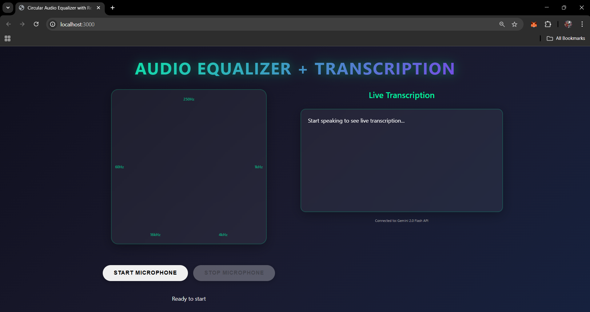
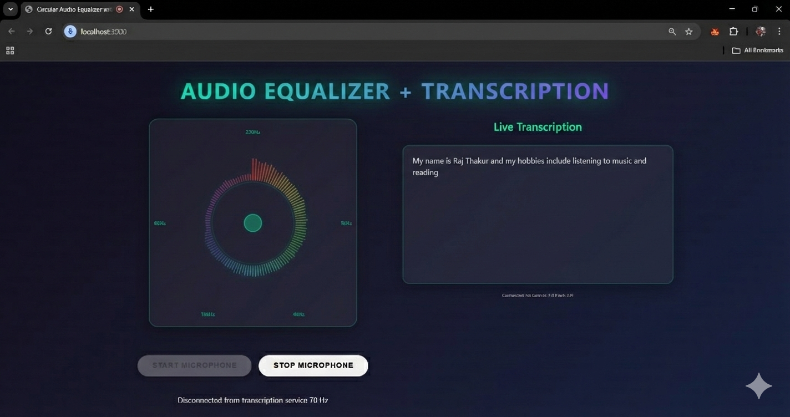

# Realtime-Audio-Transcriber

# 🎧 Audio Transcription Service

A **high-performance, real-time streaming audio transcription backend** built with **Spring Boot, WebFlux, and Google Gemini API**.  
Designed for **low latency**, **network resilience**, and **efficient resource usage**, this service streams audio chunks and returns **partial transcriptions instantly**.

---

## 🚀 Features

### 🔹 Core Capabilities
- ✅ **Real-time audio streaming** (no buffering)
- ✅ **Bi-directional communication** using WebSockets
- ✅ **Low-latency transcription** with async, non-blocking processing
- ✅ **Network resilience** with circuit breakers & retries
- ✅ **Scalable architecture** using Spring WebFlux
- ✅ **Concurrent session management**
- ✅ **Health checks & metrics monitoring**

---

## 🧰 Tech Stack

| Layer | Technology |
|-----|------------|
| Framework | Spring Boot 3.2.1 |
| Reactive | Spring WebFlux, Project Reactor |
| Streaming | WebSockets (SockJS fallback) |
| AI Engine | Google Gemini 2.0 Flash API |
| Resilience | Resilience4j |
| HTTP Client | OkHttp (connection pooling) |
| Build Tool | Maven |
| Java | Java 17+ |

---

## 📸 Screenshots

Below are sample screenshots demonstrating the service in action:

<p align="center">
  
</p>

<p align="center">
  
</p>

> 📁 Place your images inside a `screenshots/` folder in the root of the repository.

---

## 📦 Prerequisites

### System Requirements
- Java **17+**
- Maven **3.8+**
- Internet access to **Google Gemini API**

---

## 🔑 Gemini API Key

1. Visit 👉 https://aistudio.google.com  
2. Create an API key  
3. Set it as an environment variable:

```bash
# Windows
set GEMINI_API_KEY=your-api-key-here

# Linux / macOS
export GEMINI_API_KEY=your-api-key-here
